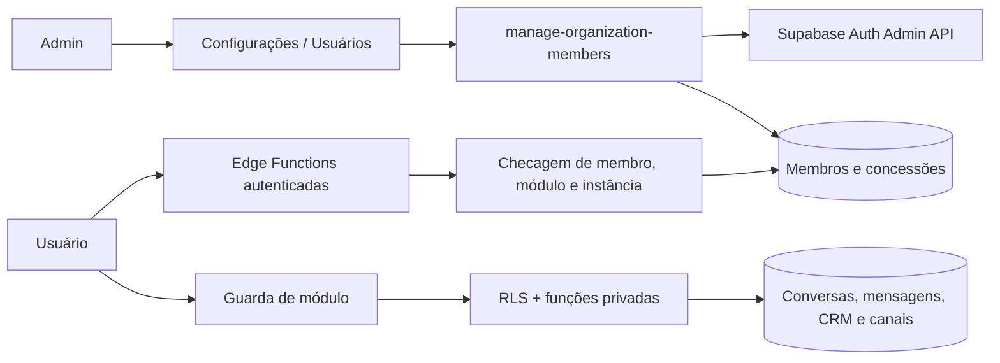

# Design — usuários e permissões

**Spec:** `.specs/features/user-access-control/spec.md`
**Status:** Approved — 2026-09-30; CRM/Conversas em conjunto, foco nos grants de dispositivo.

## Tese do desenho

O admin gerencia membros da instalação; cada membro recebe um subconjunto dos
módulos e das instâncias WhatsApp. A mesma decisão de acesso vale para a
navegação, consultas ao banco e operações executadas pelas Edge Functions. O
setup futuro da empresa limita quais módulos podem ser concedidos.

## Arquitetura

## Modelo de dados

- `organization_members.is_active`: status operacional do membro. A conta e
  seu histórico permanecem preservados ao desativar.
- `organization_members.access_review_required`: marcado na migration para
  membros existentes não-admin; desligado quando admin revisar e salvar os
  grants. Convites novos começam sem concessões e sem revisão pendente.
- `organization_member_modules(org_id, user_id, module_key)`: cada linha concede
  um módulo; módulos sem linha ficam negados.
- CRM + Conversas são uma única opção na administração. Persistir e verificar
  as duas grants juntas; nenhuma ação pode deixar apenas uma concedida.
- `organization_member_instances(org_id, user_id, instance_id)`: cada linha
  concede uma instância WhatsApp. Validar que membro e instância pertencem à
  organização da sessão.
- Backfill da migration: conceder aos membros atuais não-admin os módulos
  atuais e as instâncias atuais, preservando o acesso existente e marcando-os
  para revisão. Convites novos começam sem concessões.
- Admin mantém bypass funcional, mas não ganha concessões gravadas. O endpoint
  de membros não pode criar nem promover admins.

## Autorização

1. Criar funções em schema não exposto para verificar membro ativo, módulo e
   instância. As funções usam `auth.uid()` em vez de aceitar o ID do usuário no
   payload, fixam `search_path = ''` e qualificam objetos pelo schema.
2. **Substituir** as policies permissivas atuais de organização nas tabelas
   protegidas; acrescentar outra policy permissiva não restringe as existentes,
   pois o PostgreSQL combina policies permissivas com `OR`.
3. Aplicar módulo e, quando houver `instance_id`, concessão da instância a
   conversas, mensagens, mídia, follow-ups, canais e operações de prospecção.
   Recursos organizacionais sem instância usam a permissão de módulo.
4. Regras de autorização nas rotas complementam RLS; não substituem RLS.
   Consultas diretas ao PostgREST devem obedecer às mesmas concessões.
5. Cada Edge Function chamada pelo browser valida usuário ativo e as
   permissões necessárias antes de usar cliente `service_role`. Webhooks e
   tarefas agendadas internas continuam com seu fluxo de serviço.
6. Não devolver `instance_token` ao browser. A UI envia `instance_id`; a função
   autorizada resolve o token no servidor para operar a instância concedida.
   Remover o `SELECT` amplo para `authenticated` em `whatsapp_instances` e
   conceder apenas colunas seguras ou expor uma view segura; revogar acesso às
   colunas de credencial no banco.
7. Tornar `chat-media` privado. Guardar o caminho do objeto na mensagem e emitir
   URL assinada de curta duração somente após validar JWT, membro ativo, módulo
   Conversas e acesso à instância da conversa. Converter URLs antigas do bucket
   para o caminho do objeto antes de assinar. Links de mídia externos continuam
   sujeitos à autorização da mensagem, mas sua disponibilidade externa não é
   controlada pelo produto.

## Fluxos

### Administração de membros

Adicionar **Usuários** em Configurações, sob `AdminRoute`. A UI lista membros e
permite convidar, mudar concessões, desativar e reativar. A Edge Function
`manage-organization-members` valida JWT, papel admin e organização; usa Auth
Admin API para convite e banimento e service role apenas no servidor. No convite,
se a gravação das concessões falhar depois da criação da conta, manter o membro
sem acesso e permitir que o admin corrija as concessões depois.

O endpoint de convite e reenvio usa a secret `APP_URL` como origem de
`/aceitar-convite`; esse domínio também precisa constar na allowlist de redirect
do Supabase Auth. A secret ainda precisa ser configurada em cada projeto Supabase.

O convite redireciona para uma rota de aceite dedicada. Com a sessão criada pelo
link, a pessoa define a senha via `auth.updateUser`; depois segue para o login
normal. A rota exige uma sessão válida. O `redirectTo` precisa estar permitido
na configuração de Auth do Supabase. Reenvio usa o fluxo administrativo de
convite/recovery e não cria uma segunda associação.

Não permitir desativar o próprio admin nem o último admin ativo. A coluna
`profiles.approved` existe, mas não é usada pelo fluxo de autenticação; não a
reutilizar como autorização.

A validação do último admin e a alteração do status/papel acontecem em operação
transacional serializada por lock. Como Auth Admin e Postgres não compartilham
transação, manter a operação idempotente e reconciliável: falha no ban/unban não
pode reativar acesso aos dados; permitir retry seguro até os dois estados
convergirem.

A implementação da gravação fica em `private.admin_save_member_access`. Como a
Edge Function chama RPC via PostgREST no schema `public`, expor somente um wrapper
`public.admin_save_member_access` com execução concedida exclusivamente a
`service_role`.

Conversas com `instance_id` nulo ficam visíveis ao responsável (`user_id`) e a
admins. Conversas ligadas a um dispositivo exigem concessão desse dispositivo;
mensagens herdam a mesma regra pela conversa.

### Navegação e autorização do membro

Carregar as concessões do usuário atual em um hook compartilhado. Ocultar itens
sem módulo e negar a rota direta. Com acesso revogado, RLS e as Edge Functions
negam a próxima requisição sem depender de atualizar claims no JWT.

### Escopo por instância

A permissão de módulo e a concessão da instância são cumulativas para operações
WhatsApp. Conversas e mensagens com `instance_id` seguem a concessão da
instância. Leads e outros registros sem dispositivo seguem a concessão do
módulo, conforme a especificação aprovada.

### Dependência entre módulos

CRM + Conversas são um único conjunto de concessão: Inbox e Kanban usam a mesma
tabela `conversations`, e RLS por linha não separa suas colunas. Agenda e
Dashboard também exigem o conjunto, com filtros de instância herdados pelas
linhas consultadas. O acesso individual continua granular por outras áreas e,
principalmente, por instância WhatsApp.

## Integração com o código atual

| Área | Mudança de desenho |
|---|---|
| `src/lib/settings-nav.ts`, `App.tsx` | Adicionar página admin de usuários e guarda de módulo nas rotas. |
| `src/hooks/useAdminRole.tsx` | Preservar admin como bypass; acrescentar hook de concessões do membro. |
| `src/hooks/useOrgMembers.ts` | Reusar representação de membros e nomes; lista administrativa vem da Edge Function. |
| `supabase/migrations` | Adicionar status/revisão/grants, backfill, tornar `chat-media` privado e substituir policies atuais de organização. |
| Pré-requisito da migration | Gerar inventário de `pg_policies`, grants, tabelas acessíveis, RPCs e Edge Functions client-callable, mapeados aos módulos; a revisão e os testes precisam cobrir todos os itens. |
| `supabase/functions` | Criar `manage-organization-members`; aplicar checks de módulo/dispositivo nos handlers chamados pelo cliente. |
| `UazapiConnectionPanel`, `useAgentConfigSettings`, `manage-instance` | Trocar leituras/envios de `instance_token` por `instance_id`; exigir admin para configurações e grant de instância nas operações de membro; credenciais ficam no servidor. `download_media` valida a mensagem e emite URL assinada para objeto privado. |
| `MessageMedia.tsx`, `chat-media.ts`, `persist-media.ts` | Gravar caminhos de objetos privados e pedir URL assinada para renderizar mídia; suportar caminhos legados armazenados como URL pública. |
| Outras Edge Functions chamadas pelo cliente | Inventariar handlers que usam `service_role`; exigir JWT, membro ativo e grants apropriados. Webhooks e tarefas internas seguem validação própria. |
| `AcceptInvite.tsx`, `AuthContext.tsx`, `App.tsx` | Aceitar sessão do convite, definir senha e encaminhar para login; permitir o redirect no Supabase Auth. |

## Falhas e respostas

| Falha | Resposta |
|---|---|
| Usuário não autenticado ou inativo | `401`; nenhuma consulta com service role. |
| Não-admin chama gestão de membros | `403`; nenhuma mudança em Auth ou banco. |
| Módulo ou instância sem concessão | `403` na Edge Function; RLS retorna zero linhas ou erro de policy. |
| Convite duplicado/limite da organização | Mostrar erro específico sem conceder papel ou acesso. |
| Concessões falham após Auth criar convite | Bloquear acesso por ausência de grants; permitir correção e reenvio. |

## Revisão adversarial preliminar

1. **Policy antiga continua aberta:** uma policy nova permissiva pode ser
   combinada por `OR` com `org_conversations` e manter acesso total. A migration
   deve substituir as policies antigas e testar via Data API.
2. **Token de dispositivo exposto:** `whatsapp_instances` guarda token e URL do
   servidor; consultas em navegador e handlers com service role podem contornar
   a lista de devices. Resolver credenciais no servidor e validar o ID da
   instância em cada ação.
3. **Módulos sobre a mesma tabela:** Agenda e Conversas leem `conversations`.
   Se Agenda for independente, RLS por linha ainda pode permitir leitura de
   colunas de contato pela API direta. O design precisa isolar a Agenda com
   projeção segura ou exigir também o módulo Conversas.
4. **Convite sem conclusão:** o app atual não tem recuperação ou definição de
   senha. A implementação inclui uma rota de aceite com definição de senha.
5. **Segredos já usados no cliente:** hooks/componentes selecionam
   `instance_token` diretamente. Esses chamadores precisam migrar para
   `instance_id` antes de restringir o acesso às instâncias.
6. **Mídia de conversa continua pública:** `chat-media` é bucket público e
   mensagens guardam URLs públicas. RLS da mensagem não protege downloads pela
   URL; tornar o bucket privado e assinar após validar autorização é parte do
   controle por módulo/dispositivo.
7. **CRM e Conversas compartilham linhas e colunas:** resolvido no MVP com uma
   concessão conjunta e liberação/revogação simultânea das duas rotas.
6. **Mídia de conversa continua pública:** `chat-media` é bucket público e
   mensagens guardam URLs públicas. RLS da mensagem não protege um download pela
   URL; tornar o bucket privado e assinar após validar autorização é parte do
   controle por módulo/dispositivo.
7. **CRM e Conversas compartilham linhas e colunas:** além de Agenda, Kanban e
   Inbox consultam `conversations`. Policies por linha não implementam grants
   independentes por módulo nesse formato.

## Revisão `/the-fool` — Red Team

Escopo: caminhos de bypass por membro autenticado e falhas na aplicação das
regras. Achados baseados no desenho e nos caminhos atuais do repositório; ainda
não são validação de uma implementação.

1. **ACEITO — acesso por instância pode ser contornado via token.** Hoje a RLS
   de `whatsapp_instances` permite leitura de todas as linhas da organização
   (`20260928140000_organization.sql`), inclusive credenciais. `manage-instance`
   também resolve ações pelo token enviado no body sem vincular o resultado ao
   usuário autenticado (`supabase/functions/manage-instance/index.ts`). Trocar
   o payload por ID não basta: revogar acesso SQL às colunas secretas, validar
   cada ação contra membro, módulo e instância e remover o fallback global de
   ações de membro. Para `authenticated`, trocar o grant de tabela por grants de
   colunas seguras (ou view segura), sem SELECT em credenciais.
2. **ACEITO — tabela sem grant pode continuar aberta por política esquecida.**
   O repositório tem policies distribuídas por várias migrations e várias
   tabelas relacionadas. A intenção de substituir policies antigas não define
   como provar cobertura. Antes da migration, inventariar `pg_policies`, grants,
   tabelas acessíveis e Edge Functions/RPCs por módulo; depois testar a lista
   completa com acesso direto. Uma policy permissiva esquecida anula a nova
   restrição naquela tabela. O inventário é pré-requisito da migration e inclui
   as rotas server-side chamadas pelo cliente.
3. **ACEITO — duas desativações concorrentes podem remover o último admin.**
   Checar a contagem e depois banir/desativar em chamadas separadas permite que
   duas requisições simultâneas passem pela checagem. Fazer a alteração de papel
   ou status em transação com lock e validar o último admin dentro dela; tratar o
   banimento Auth como etapa idempotente e reconciliável, pois Auth e Postgres
   não compartilham transação.
4. **ACEITO — semântica “preservar acesso” pode mascarar uma migração incompleta.**
   O backfill concede todos os módulos e dispositivos atuais. Isso preserva o
   comportamento solicitado, mas não reduz acessos automaticamente; por isso,
   a UI mostra essa herança e sinaliza cada membro pendente de revisão. Ao salvar
   a revisão, o app limpa `access_review_required`.

As respostas do usuário aceitaram os quatro achados e suas mitigações. A
confiança no desenho após incorporá-las é **MÉDIA**: o maior risco restante é a
cobertura incompleta do inventário de acesso. Experimento de validação: executar
testes com usuários reais de mesma organização contra cada tabela, RPC e ação
client-callable listada, antes de aplicar a migration.

O usuário escolheu conceder CRM e Conversas em conjunto no MVP e priorizou o
bloqueio de dispositivos por usuário. A migration aplica as duas grants juntas
e restringe consultas e ações pelo `instance_id`.

## Validação técnica

- Dois usuários de teste na mesma organização, cada um com uma instância distinta.
- Testar navegação, rota direta, PostgREST e Edge Functions, com grants e sem.
- Testar combinações Agenda/Conversas e tentativas de ler mensagens ou tokens.
- Revogar grant e desativar membro durante sessão existente; chamadas seguintes
  devem ser negadas.
- Confirmar admin com acesso total, proteção do último admin e preservação do
  histórico ao desativar.
- Testar limite de cinco membros e caminho de convite/reenvio com email de teste.
- Testar redirect permitido, definição de senha e login após convite; convite
  expirado deve aceitar reenvio pelo admin.

## Referências técnicas

- [RLS do Supabase](https://supabase.com/docs/guides/database/postgres/row-level-security)
- [Convites de usuários](https://supabase.com/docs/guides/auth/users)
- [Atualização e banimento de usuários](https://supabase.com/docs/reference/javascript/auth-admin-updateuserbyid)
