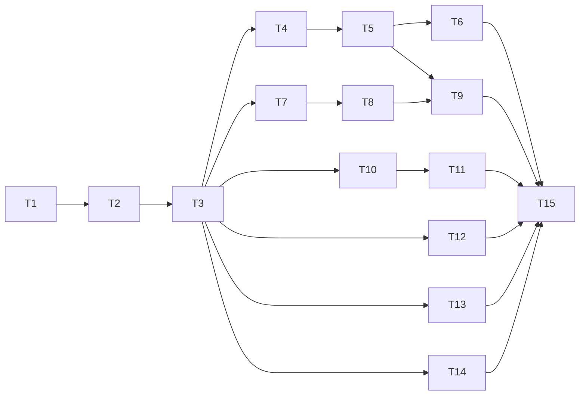

# Usuários e permissões — tarefas

**Spec:** `.specs/features/user-access-control/spec.md`
**Design:** `.specs/features/user-access-control/design.md`
**Status:** In Progress — CRM/Conversas em conjunto; prioridade nos grants de dispositivo.

## Plano de execução

### Fase 1 — Inventário e fundação

`T1 → T2 → T3`

O inventário é a entrada obrigatória da migration e dos controles server-side.

### Fase 2 — Administração e aceite de convite

Após `T3`, `T4`, `T7`, `T10`, `T12`, `T13` e `T14` podem avançar em paralelo.
`T5` depende de `T4`; `T6` depende de `T5`.

### Fase 3 — Permissões na aplicação e dispositivos

`T8` depende de `T7`; `T9` depende de `T5`, `T7` e `T8`; `T11` depende de
`T10`.

### Fase 4 — Integração e segurança

`T15` depende de todas as tarefas anteriores.

## Tarefas

### T1: Inventariar a superfície de autorização [x]

**What:** Mapear tabelas, policies RLS, grants, RPCs e Edge Functions acessíveis
ao cliente para os módulos e escopos de instância definidos no design.
**Where:** `.specs/features/user-access-control/access-inventory.md`
**Depends on:** Nenhuma.
**Reuses:** Migrations em `supabase/migrations`; chamadas `functions.invoke` em `src`.
**Tools:** MCP: nenhum; shell/`rg`. Skill: `tlc-spec-driven`.

**Done when:**

- [x] Toda tabela com dados do produto tem operações, policy atual e módulo
      identificados ou está explicitamente fora do escopo.
- [x] Toda RPC e Edge Function client-callable tem autenticação, escopo e uso
      de `service_role` registrados.
- [x] Leituras de credenciais WhatsApp no cliente estão localizadas.
- [x] `rg` reproduz os pontos de entrada documentados e o catálogo local confirmou
      as policies/grants efetivos; o Supabase remoto não foi consultado.

**Verify:** `rg -n 'create policy|CREATE POLICY' supabase/migrations` e
`rg -n 'functions\.invoke|instance_token' src`; os resultados devem constar ou
estar justificados no inventário.

### T2: Criar migration de membros, grants e RLS

**What:** Adicionar status/revisão, grants de módulo/dispositivo, backfill,
funções de autorização privadas, privilégios seguros e substituir as policies
do inventário sem deixar acesso permissivo residual.
**Where:** Nova migration em `supabase/migrations/`.
**Depends on:** T1.
**Reuses:** `20260928140000_organization.sql`; helpers SQL do design.
**Tools:** MCP: nenhum; Supabase CLI. Skill: `coding-guidelines`.

**Done when:**

- [ ] Membros atuais não-admin recebem acesso equivalente ao atual e ficam com
      `access_review_required = true`; novos convites começam sem grants.
- [ ] Admin tem bypass; membro inativo ou sem grant é negado pelas funções e
      policies.
- [ ] A cobertura da migration corresponde a todo o inventário de T1.
- [ ] `authenticated` não lê credenciais de `whatsapp_instances`; metadados
      seguros continuam disponíveis conforme necessidade do produto.
- [ ] Bucket `chat-media` fica privado; `organization-brand` permanece público
      para logos, com escrita admin-only.
- [ ] CRM e Conversas são concedidos/revogados juntos no endpoint e na UI.
- [ ] CRM/Conversas, Agenda e Dashboard exigem o conjunto e seguem o escopo por
      instância.
- [x] As migrations novas aplicam em sequência no banco local existente sem
      reset; o banco local contém dados e não foi apagado.

**Verify:** `supabase migration up --local` e
`node --test tests/db/user_access_control.test.mjs`; esperado: migrations e
matriz de acesso passam sem apagar o banco local populado.

### T3: Testar matriz de acesso no banco

**What:** Criar testes de regressão RLS/grants para membros, módulos, instâncias,
Agenda e colunas secretas.
**Where:** `tests/db/user_access_control.test.mjs`
**Depends on:** T2.
**Reuses:** Harness em `tests/db/`.
**Tools:** MCP: nenhum; Node e Supabase CLI. Skill: `coding-guidelines`.

**Done when:**

- [ ] Dois membros com grants diferentes não leem nem alteram dados fora do
      módulo/instância concedidos via PostgREST.
- [ ] Agenda sem Conversas e consultas às colunas secretas falham.
- [ ] Admin conserva acesso; membro inativo perde acesso sem apagar histórico.
- [ ] Casos do backfill e convite sem grants são cobertos.
- [ ] `node --test tests/db/user_access_control.test.mjs` passa.

**Verify:** `node --test tests/db/user_access_control.test.mjs`; esperado: todos
os testes passam contra o Supabase local.

### T4: Implementar operações transacionais de membro

**What:** Criar operações SQL idempotentes para concessões e transições de
status, serializando a proteção do último admin e permitindo reconciliação Auth.
**Where:** Migration SQL em `supabase/migrations/` e testes DB correspondentes.
**Depends on:** T2.
**Reuses:** Tabelas/helper functions introduzidas por T2.
**Tools:** MCP: nenhum; Supabase CLI. Skill: `coding-guidelines`.

**Done when:**

- [ ] A validação e atualização do último admin são atômicas sob concorrência.
- [ ] Grants só aceitam módulos e instâncias da organização do membro.
- [ ] Falhas entre Auth e Postgres deixam estado sem acesso indevido e permitem
      retry idempotente.
- [ ] Testes cobrem chamadas repetidas, grants inválidos e duas desativações
      concorrentes.
- [ ] Testes DB de T3 passam.

**Verify:** `node --test tests/db/user_access_control.test.mjs`; esperado: testes
de concorrência e repetição passam.

### T5: Criar Edge Function de gestão de membros

**What:** Implementar convite, listagem, grants, ativação/desativação e reenvio
com verificação admin no servidor.
**Where:** `supabase/functions/manage-organization-members/index.ts`
**Depends on:** T4.
**Reuses:** Padrões de JWT e respostas das Edge Functions atuais.
**Tools:** MCP: nenhum; Node/Deno. Skills: `coding-guidelines`, `security-best-practices`.

**Done when:**

- [ ] JWT inválido/inativo recebe `401`; não-admin recebe `403` em todas as ações.
- [ ] Convite não cria/promove admin e começa sem grants não selecionados.
- [ ] A organização vem da sessão/membership, nunca de ID confiado do payload.
- [ ] Limite de usuários, duplicidade e falhas Auth/DB têm respostas seguras e
      retry possível.
- [ ] Configurar `APP_URL` nas secrets das Edge Functions e incluí-la na allowlist
      de redirect do Supabase Auth.
- [ ] Testes de handler cobrem as ações administrativas e negações.

**Verify:** `node --test tests/handler/manage-organization-members.test.mjs`;
esperado: testes do endpoint passam.

### T6: Implementar aceite do convite e definição de senha

**What:** Criar fluxo de aceite de convite com sessão válida, definição de senha
e retorno ao login.
**Where:** `src/pages/AcceptInvite.tsx`, `src/contexts/AuthContext.tsx`, `src/App.tsx`.
**Depends on:** T5.
**Reuses:** `Login.tsx`, `SsoBridge.tsx`, contexto atual de autenticação.
**Tools:** MCP: nenhum. Skills: `coding-guidelines`, `react-best-practices`.

**Done when:**

- [ ] Link válido permite definir senha e concluir sem signup público.
- [ ] Link expirado/sem sessão mostra erro acionável sem expor dados.
- [ ] Recarregar durante o callback mantém estado consistente.
- [ ] `npm run build` passa.

**Verify:** `npm run build`; esperado: build concluído; testar manualmente fluxo
com convite de email no Supabase local.

### T7: Criar hook de permissões do membro

**What:** Consultar e expor grants efetivos, status e revisão pendente do usuário
atual com admin bypass.
**Where:** `src/hooks/useMemberAccess.ts`
**Depends on:** T3.
**Reuses:** `useAdminRole.tsx`, `AuthContext.tsx`.
**Tools:** MCP: nenhum. Skills: `coding-guidelines`, `react-best-practices`.

**Done when:**

- [ ] Admin tem acesso total; membro carrega somente grants da sessão atual.
- [ ] Loading e erros não liberam acesso por padrão.
- [ ] Revogação/reativação reflete após atualizar a consulta, sem depender de
      claims JWT.
- [ ] `npm run lint` passa.

**Verify:** `npm run lint`; esperado: sem erros ESLint.

### T8: Proteger rotas e navegação por módulo

**What:** Aplicar grants às rotas e itens de navegação; respeitar dependências
aprovadas para CRM, Conversas, Agenda e Dashboard e preservar logo como Dashboard.
**Where:** `src/App.tsx`, `src/components/layout/MainHeader.tsx` e guarda de rota.
**Depends on:** T7.
**Reuses:** `ProtectedRoute`, `AdminRoute`, mapa da navegação atual.
**Tools:** MCP: nenhum. Skills: `coding-guidelines`, `react-best-practices`.

**Done when:**

- [ ] Itens e rotas sem grant ficam ocultos/negados, inclusive acesso por URL.
- [ ] CRM e Conversas sempre liberam/bloqueiam juntos; Agenda/Dashboard exigem
      esse conjunto; configurações administrativas seguem admin-only.
- [ ] Admin continua vendo todas as rotas liberadas do produto.
- [ ] `npm run build` passa.

**Verify:** `npm run build`; esperado: build concluído e matriz de rotas validada.

### T9: Criar tela administrativa de usuários

**What:** Exibir membros e permitir convite, grants de módulo/dispositivo,
revisão dos acessos herdados e ativação/desativação.
**Where:** página e componentes em `src/pages/configuracoes/` e navegação settings.
**Depends on:** T5, T7 e T8.
**Reuses:** componentes de Settings, `AdminRoute`, componentes shadcn existentes.
**Tools:** MCP: nenhum. Skills: `coding-guidelines`, `react-best-practices`.

**Done when:**

- [ ] Apenas admin acessa a tela e as ações continuam protegidas no servidor.
- [ ] Lista indica status e `access_review_required` com ação para revisar/salvar.
- [ ] Convite, edição, reenvio, desativação e reativação refletem após sucesso;
      erros não exibem sucesso falso.
- [ ] Não permite desativar a si mesmo nem remover o último admin.
- [ ] `npm run lint && npm run build` passa.

**Verify:** `npm run lint && npm run build`; esperado: ambos passam; exercitar os
fluxos de UI com usuários admin e comum.

### T10: Migrar `manage-instance` para autorização por ID

**What:** Resolver credenciais no servidor por `instance_id`, autorizar cada ação
por JWT, membro, módulo, instância e papel exigido; emitir URL assinada apenas
para mídia de mensagem autorizada.
**Where:** `supabase/functions/manage-instance/index.ts`
**Depends on:** T3.
**Reuses:** Helpers SQL de T2 e operações por ID existentes.
**Tools:** MCP: nenhum; Node/Deno. Skills: `coding-guidelines`, `security-best-practices`.

**Done when:**

- [ ] Ações de usuário exigem JWT válido e membro ativo.
- [ ] Não há lookup por token fornecido pelo cliente nem fallback global para
      chamadas não-admin.
- [ ] Instância fora dos grants recebe `403`; configurações globais exigem admin.
- [ ] `download_media` valida módulo e instância da conversa antes de emitir URL
      assinada para objeto privado ou buscar mídia externa.
- [ ] Cobertura de teste inclui cada ação client-callable do handler.
- [ ] `node --test tests/handler/manage-instance.test.mjs` passa.

**Verify:** `node --test tests/handler/manage-instance.test.mjs`; esperado: casos
de acesso permitido, negado e token legado passam conforme contrato.

### T11: Migrar chamadores de token para ID seguro

**What:** Atualizar componentes/hooks para usar ID da instância e metadados
seguros, sem selecionar `instance_token` no browser; renderizar mídia privada
por URL assinada e manter compatibilidade com URLs públicas antigas.
**Where:** `src/components/uazapi/UazapiConnectionPanel.tsx`,
`src/pages/Conversas.tsx`, `src/hooks/useAgentConfigSettings.ts`,
`src/hooks/useContactAvatarEnrichment.ts`, `src/components/inbox/MessageMedia.tsx`,
`src/lib/chat-media.ts`, `supabase/functions/_shared/persist-media.ts`.
**Depends on:** T10.
**Reuses:** Contrato por ID definido em T10.
**Tools:** MCP: nenhum. Skills: `coding-guidelines`, `react-best-practices`.

**Done when:**

- [ ] Nenhum caminho de produção no browser lê ou envia `instance_token`.
- [ ] Seletor mostra somente instâncias concedidas e metadados seguros.
- [ ] Operações administrativas de conexão/configuração permanecem admin-only.
- [ ] Novas mensagens armazenam caminho do objeto, não URL pública; uploads
      exigem usuário ativo com Conversas.
- [ ] Mídias antigas no bucket são resolvidas para path e assinadas após
      autorização; URLs externas continuam renderizando para mensagens acessíveis.
- [ ] `npm run lint && npm run build` passa; `rg -n 'instance_token' src` não
      encontra seleção/envio de credencial em runtime.

**Verify:** `npm run lint && npm run build` e `rg -n 'instance_token' src`;
esperado: build/lint passam e resultados restantes são apenas tipos/comentários
sem leitura de segredo em runtime.

### T12: Restringir `test-uazapi`

**What:** Exigir JWT, membro ativo e papel admin para testar credenciais e
configuração global Uazapi.
**Where:** `supabase/functions/test-uazapi/index.ts` e teste de handler.
**Depends on:** T2.
**Reuses:** Verificação JWT/admin de `manage-installation`.
**Tools:** MCP: nenhum; Node/Deno. Skills: `coding-guidelines`, `security-best-practices`.

**Done when:**

- [ ] Anônimo, membro inativo e não-admin recebem negação antes de acessar
      credenciais/serviço externo.
- [ ] Admin autorizado mantém o teste funcional.
- [ ] Testes de handler passam.

**Verify:** `node --test tests/handler/test-uazapi.test.mjs`; esperado: negações e
caso admin passam.

### T13: Aplicar autorização à conexão de IA

**What:** Exigir membro ativo e grant de Configurações antes de ler credenciais
salvas ou chamar provedores em `test-ai-connection`.
**Where:** `supabase/functions/test-ai-connection/index.ts` e teste de handler.
**Depends on:** T2.
**Reuses:** Helper de autorização do design.
**Tools:** MCP: nenhum; Node/Deno. Skills: `coding-guidelines`, `security-best-practices`.

**Done when:**

- [ ] Sessão inválida/inativa ou sem Configurações é negada antes de ler `agent_configs`.
- [ ] Usuário com grant mantém teste funcional sem receber segredo armazenado.
- [ ] Testes de handler passam.

**Verify:** `node --test tests/handler/test-ai-connection.test.mjs`; esperado:
negações e caso autorizado passam.

### T14: Revalidar gestão de instalações

**What:** Confirmar que ações de `manage-installation` exigem admin ativo e
continuam isoladas do CRUD de membros.
**Where:** `supabase/functions/manage-installation/index.ts` e teste de handler.
**Depends on:** T2.
**Reuses:** Verificação admin existente.
**Tools:** MCP: nenhum; Node/Deno. Skills: `coding-guidelines`, `security-best-practices`.

**Done when:**

- [ ] Usuário inativo não usa operações com service role mesmo com JWT anterior.
- [ ] Admin ativo preserva as ações atuais de instalação.
- [ ] Testes de handler passam.

**Verify:** `node --test tests/handler/manage-installation.test.mjs`; esperado:
negação e operações admin passam.

### T15: Validar ponta a ponta e fechar revisão de segurança

**What:** Executar os critérios da spec com dois membros, admin e convite; revisar
diff completo e corrigir achados de autorização antes de considerar concluído.
**Where:** Testes DB/handler, UI local e todos os arquivos tocados pela feature.
**Depends on:** T1–T14.
**Reuses:** Matriz de T1 e critérios em `spec.md`.
**Tools:** MCP: nenhum; Supabase CLI, Node e browser local. Skills:
`coding-guidelines`, `security-best-practices`.

**Done when:**

- [ ] Testes SQL, handlers, `npm run lint` e `npm run build` passam.
- [ ] Cada tabela/RPC/Edge Function/bucket do inventário tem caso permitido e
      negado.
- [ ] Convite, definição de senha, grants, revogação, inativação e preservação
      do histórico foram verificados.
- [ ] Revisão adversarial não deixa achado BLOCKER aberto.

**Verify:** `supabase db reset && node --test tests/db/user_access_control.test.mjs tests/handler/manage-organization-members.test.mjs tests/handler/manage-instance.test.mjs tests/handler/test-uazapi.test.mjs tests/handler/test-ai-connection.test.mjs tests/handler/manage-installation.test.mjs && npm run lint && npm run build`; esperado: exit code 0 em todas as etapas.

## Granularidade e dependências abertas

- `T1` pode acrescentar Edge Functions/RPCs ainda não listados aqui; cada
  handler client-callable adicional precisa de tarefa própria antes da execução.
- CRM/Conversas em conjunto é a decisão aprovada do MVP; rever a separação após
  criar projeções próprias seguras para cada módulo.
- A migration de `T2` é uma unidade de deploy intencional: políticas e grants
  devem entrar juntos para não criar uma janela de acesso permissivo.
- Nenhuma tarefa aplica migration remota, faz commit, push ou deploy.
